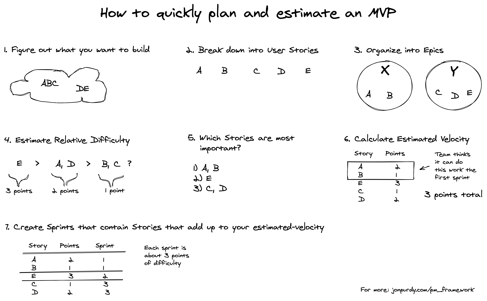
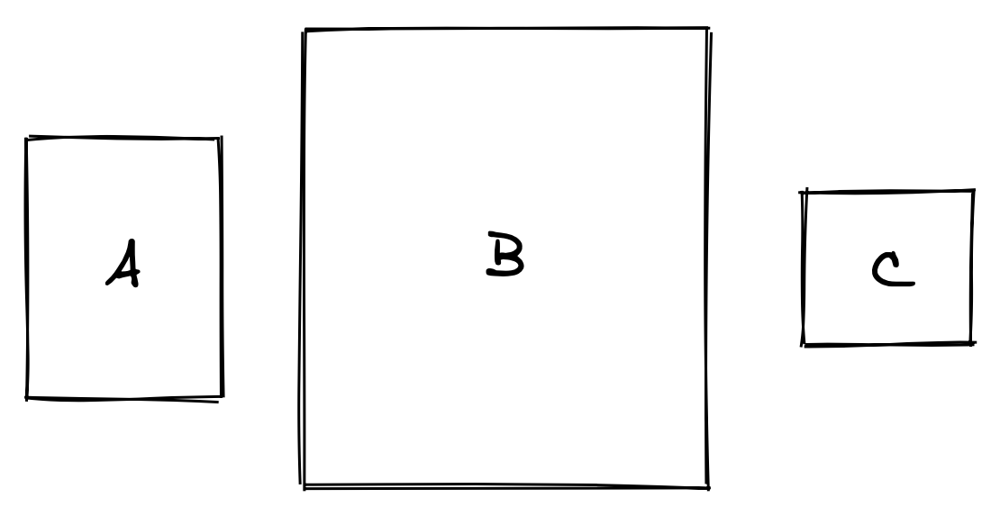

# How to quickly plan and estimate an MVP

## Diagram

## Initial questions

What do you want to build?  
What does it look like?  
Who are the people who will use it?  

## Break down the work

With these questions asked, break down the work (into Epics and User Stories).

Start off in a text file or spreadsheet, easier to edit. Don't do this in Jira.

**User Stories**: an action that a user wants to do and why  
**Epic**: grouping of related user stories

CRUD stories are a good baseline  
- Create, Read, Update, Delete  
- Ex. for a product-related site: Create product, View (read) product description, Update product (description), Delete product

### Examples 

| Epic/Group | User Story                                   |
|------------|----------------------------------------------|
| Account    | User can create an account                   |
| Account    | User can view their account details          |
| Account    | User can update the details of their account |
| Account    | User can delete their account                |
| Shopping   | User can view list of store items            |
| Shopping   | User can view item details                   |
| Shopping   | User can add items to their cart             |
| Shopping   | User can view contents of their cart         |
| Purchase   | User can initiate checkout and pay           |

## Estimate

When starting fresh, it's impossible to accurately predict how long it will take to build.

Things that affect estimation accuracy:  
- new team  
- new project  
- adding or removing a team member  
- number of hours per week working on this project  
- variable number of interruptions/distractions affecting productivity  

Time-based estimation will fail. Difficulty-based estimation is mostly independent of that list. This is why we use *Story Points* instead of *hours/days*.

### How to estimate difficulty?

Relative estimation.

Simple example: **how big is A**?  

Just by eyeballing it, you don't know exactly how big it is in cm or pixels, but you can figure out that it is **smaller than B** and **bigger than C**.

If you have two User Stories, it doesn't matter "how long they will take". Is one of the stories more difficult than the other? If so, it will be rated more Story Points. 

### Do it

**1)** Choose an "easy" story, ask the team to consider how difficult it is, then assign it 2 points  
**2)** Choose another story. Ask the team: is it easier or harder to build than the first story?  
**2a)** If easier, assign it 1 point.  
**2b)** If harder, how much harder? Assign it 3 or more points.  

Use this scale: 1, 2, 3, 5, 8, 13, 20, 40, 100  
*(Reason for this: It's obvious that a 5-point story is more difficult than a 3 point story, but what's the actual difference betwen a 13 and 14 point story? Bigger numbers are more spaced apart to prevent wasting time on estimation that is overly granular.)*

**3)** Do this for each story, and verify throughout that each additional estimated story is relative to other stories; you may need to go back and change the values as you do this. 

Example: story-A is 2 points, story-B is 3 points. story-C comes along and is estimated to be harder than story-A but easier than story-B:  
B (3) > C (**?**) > A(2)  

In that case, assign story-C 3 points and change story-B to 4 points:  
B (**4**) > C (**3**) > A(2)

**Example table updated with "point value" column**

| Epic/Group | User Story                                   | Point Value |
|------------|----------------------------------------------|-------------|
| Account    | User can create an account                   | 2           |
| Account    | User can view their account details          | 1           |
| Account    | User can update the details of their account | 2           |
| Account    | User can delete their account                | 1           |
| Shopping   | User can view list of store items            | 1           |
| Shopping   | User can view item details                   | 2           |
| Shopping   | User can add items to their cart             | 2           |
| Shopping   | User can view contents of their cart         | 1           |
| Purchase   | User can initiate checkout and pay           | 8           |

If a story ends up being unusually large compared to others, try to break it down into smaller stories.

In the example, "User can initiate checkout and pay" can break down into:  

| Epic/Group | User Story                                   | Point Value |
|------------|----------------------------------------------|-------------|
| <del>Purchase<del>   | <del>User can initiate checkout and pay<del> | <del>8<del> |
| Purchase   | User can initiate checkout process           | 2           |
| Purchase   | User can enter their billing details         | 1           |
| Purchase   | User can enter their shipping details        | 2           |
| Purchase   | User can submit payment                      | 1           |
| Purchase   | User can view their order details            | 2           |

**4)** Once all stories have an estimate, put the stories in priority order. What needs to be built first? What stories do others depend on? Which stories provide the most business value?

**Example table re-sorted by priority**

| Epic/Group | User Story                                     | Point Value |
|------------|------------------------------------------------|-------------|
| Account    | User can create an account                     | 2           |
| Shopping   | User can view list of store items              | 1           |
| Shopping   | User can view item details                     | 2           |
| Shopping   | User can add items to their cart               | 2           |
| Shopping   | User can view contents of their cart           | 1           |
| Purchase   | User can initiate checkout process             | 2           |
| Purchase   | User can enter their billing details           | 1           |
| Purchase   | User can enter their shipping details          | 2           |
| Purchase   | User can submit payment                        | 1           |
| Purchase   | User can view their order details              | 2           |
| Account    | *User can view their account details*          | 1           |
| Account    | *User can update the details of their account* | 2           |
| Account    | *User can delete their account*                | 1           |

*I moved the italicized stories to the bottom. In this case, I think it's more important that the user can use the stores and purchase items than to update or delete their account.*

## Create a rough plan

*This deviates a bit from Agile/Scrum best practices. It doesn't make any guarantees,  but people like to have some sort of estimate when things will be completed (even if the estimate is known to have a large margin of error. But it's good enough to provide a rough guide to plan future development, marketing releases, how high to charge a customer to make sure you don't lose money on a new project, etc.*

With the existing team, think hard about how many stories the team could finish in a sprint (I like 1-week sprints). As an example, let's say they think they can complete the first three stories, which adds up to 5 points. This is the *estimated velocity*.

| Epic/Group | User Story                                     | Point Value |
|------------|------------------------------------------------|-------------|
| Account    | User can create an account                     | 2           |
| Shopping   | User can view list of store items              | 1           |
| Shopping   | User can view item details                     | 2           |
|            | TOTAL                                          | 5           |

Compare it to the total number of points for the whole project (in this example, 20 points).

20 points total / 5 points for this sprint = **4 sprints to finish**

**Example with sprint added**  

| Epic/Group | User Story                                     | Point Value |Sprint|
|------------|------------------------------------------------|-------------|------|
| Account    | User can create an account                     | 2           | 1    |
| Shopping   | User can view list of store items              | 1           | 1    |
| Shopping   | User can view item details                     | 2           | 1    |
| Shopping   | User can add items to their cart               | 2           | 2    |
| Shopping   | User can view contents of their cart           | 1           | 2    |
| Purchase   | User can initiate checkout process             | 2           | 2    |
| Purchase   | User can enter their billing details           | 1           | 3    |
| Purchase   | User can enter their shipping details          | 2           | 3    |
| Purchase   | User can submit payment                        | 1           | 3    |
| Purchase   | User can view their order details              | 2           | 3    |
| Account    | *User can view their account details*          | 1           | 4    |
| Account    | *User can update the details of their account* | 2           | 4    |
| Account    | *User can delete their account*                | 1           | 4    |

## Stuff to elaborate on later

The accuracy of this prediction will need to be modified once you start going through sprints. Your *velocity* will likely be variable at the beginning of a project and will smooth out as the team goes through more sprints.

How inaccurate could this prediction be?  Maybe there's going to be a lot of variability with this team, so estimates should be +/- 50% margin of error (that's actually pretty good).
